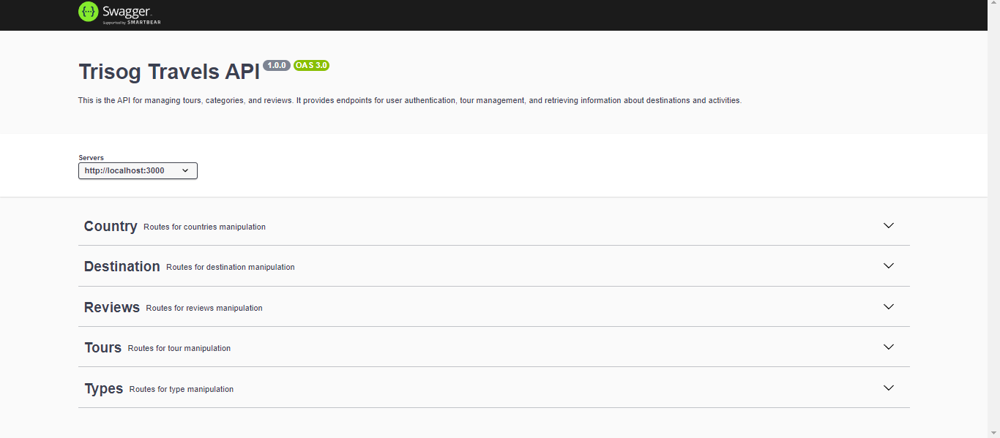

# Api criada para o Projeto Trisog Travels

## Desafio 3 - Semana 12 - SP - FullStack Journey (Node.js&React) - AWS Cloud Context - Compass UOL

# Travel Agency Backend

<div align="center">
  <br/>
  
</div>


This project is the backend for a travel agency application. It provides APIs for managing tours, destinations, and reviews.

## Table of Contents

1. [Installation](#installation)
2. [Usage](#usage)
3. [Project Structure](#project-structure)
4. [Authors and Acknowledgments](#authors-and-acknowledgments)
5. [References and Links](#references-and-links)

## Installation

To get started, clone the repository and install the dependencies:

```bash
git clone https://github.com/yourusername/travel-agency-backend.git
cd travel-agency-backend
npm install
```

## Usage

To start the server, use:

```
npm start
```

For development with live reloading, use:
```
npm run dev
```

To generate the Swagger documentation, use:
```
npm run swagger-generate
```

## Project Structure
- src/: Source code
  - server.ts: Entry point of the application
  - swagger/: Swagger documentation generation
  - routes/: API routes
  - models/: Database models
  - controllers/: Business logic and request handling
  - public/: Static files
  - swagger.json: Swagger API documentation
  - helpers: helpers to assist 
  - database: database 
  - config: app, database and swagger config

## Authors

- Diego Otani

## References and Links

- Express documentation: https://expressjs.com/ 
- Swagger JSDoc: https://www.npmjs.com/package/swagger-jsdoc
- Swagger UI Express: https://www.npmjs.com/package/swagger-ui-express